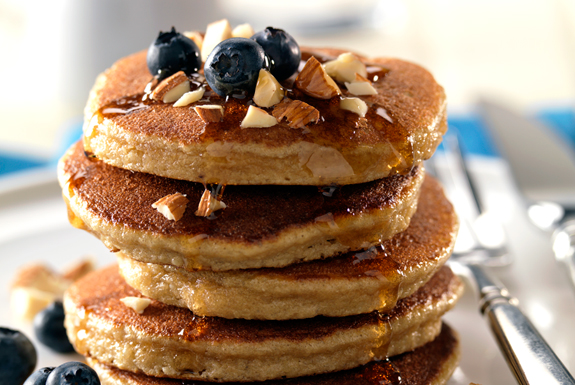
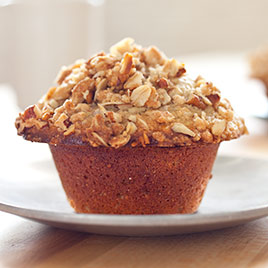
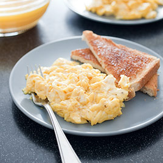

# Breakfast

[Featherweight Pancakes](#FeatherweightPancakes)   
[Silver Dollar Pancakes](#SilverDollarPancakes)  
[Oatmeal Muffins](#OatmealMuffins)  
[Scrambled Eggs](#ScrambledEggs)  

---

## Featherweight Pancakes

### Ingredients
*Serves 3 to 4 (about 8 3in pancakes)*
  
---:|
	1 |cup| 	flour
	2 |tsp| 	granulated sugar
	½ |tsp| 	table salt
	½ |tsp| 	baking powder
	1/4 |tsp| baking soda
	3/4 |cup| buttermilk
	1/4 |cup| milk
	1 |large| egg, separated
	2 |tbsp| 	unsalted butter, melted  

### Method
1. Mix dry ingredients in medium bowl. 
2. Pour buttermilk and milk into 2-cup Pyrex measuring cup. 
3. Mix yolk with melted butter, then stir into milk mixture. 
4. Whisk egg white in large bowl to stiff peaks. 
5. Dump wet ingredients into dry ingredients all at once; whisk until just mixed. Quickly fold egg white into batter.
2. Meanwhile, heat griddle or large skillet over strong medium-high heat. Brush griddle generously with oil. 
3. Spoon batter, about 1/4 cup at a time, onto griddle, making sure not to overcrowd. 
4. When pancake bottoms are brown and top surface starts to bubble, 2 to 3 minutes, flip cakes and cook until remaining side has browned, 1 to 2 minutes longer. 
5. Re-oil the skillet and repeat for the next batch of pancakes.

[Cooks Illustrated](https://www.cooksillustrated.com/recipes/1277-featherweight-pancakes)

---

## Silver Dollar Pancakes

### Ingredients
---:|
	3| 		large| eggs
	1 |tbsp|	water
	1 |tbsp|	vanilla extract
	2 |tbsp|	agave nectar or honey
	1 ½ |cups| blanched almond flour
	1/4 |tsp|	celtic sea salt
	1/4 |tsp|	baking soda

### Method
1. In a large bowl whisk together eggs, water, vanilla and agave
2. Add almond flour, salt and baking soda and mix until thoroughly combined
3. Heat grapeseed oil on skillet over medium low to medium heat
4. Scoop 1 heaping tablespoon of batter at a time onto the skillet
5. Pancakes will form little bubbles, when bubbles open, flip pancakes over and cook other side
6. Remove from heat to a plate
7. Repeat process with remaining batter, add more oil to skillet as needed

[Elana's Pantry](http://www.elanaspantry.com/silver-dollar-pancakes)

---

## Oatmeal Muffins

For an oatmeal muffin that is packed with oats but also has a fine, tender texture, we processed old-fashioned rolled oats into a flour in the food processor. To boost oat flavor, we first toasted the oats in a couple of tablespoons of butter and eliminated extraneous spices from the batter. To ensure a lump-free batter, we used a whisk to fold the wet and dry ingredients together and allow the batter to sit and hydrate for 20 minutes before baking. Finally, we made an apple crisp-inspired topping of crunchy oats, nuts, and brown sugar.

### Ingredients
*Makes 12 Muffins*

#### Topping
---:|
	42|g|		Rolled oats
	47|g|		Plain flour
	1/3 |cup|	Pecans / Walnuts chopped fine
	66|g|		Raw castor sugar
	1 |tsp|	Cinnamon
	1/8 |tsp|	Salt
	55|g|		Melted butter

#### Muffins
---:|
	30|g|		Butter
	85|g|		Melted butter
	170|g|	Rolled Oats
	250|g|	Self-raising flour
	1 ½ |tsp| Salt
	265|g|	Raw castor sugar
	355|mL|	Milk
	2	||	Eggs, beaten

### Method
1. FOR THE TOPPING: Combine oats, flour, pecans, sugar, cinnamon, and salt in medium bowl. 
2. Drizzle melted butter over mixture and stir to ­thoroughly combine; set aside.
3. FOR THE MUFFINS: Grease and flour 12-cup muffin tin. 
4. Melt 2 tablespoons butter in 10-inch skillet over medium heat. Add oats and cook, stirring frequently, until oats turn golden brown and smell of cooking popcorn, 6 to 8 minutes. 
5. Transfer oats to food processor and process into fine meal, about 30 seconds. 
6. Add flour, and salt to oats and pulse until combined, about 3 pulses.
7. Stir 6 tablespoons melted butter and sugar together in large bowl until smooth. 
8. Add milk and eggs and whisk until smooth. 
9. Using whisk, gently fold half of oat mixture into wet ingredients, tapping whisk against side of bowl to release clumps. Add remaining oat mixture and continue to fold with whisk until no streaks of flour remain. 
10. Set aside batter for 20 minutes to thicken. 
11. Meanwhile, adjust oven rack to middle position and heat oven to 190 degrees.
12. Using ice cream scoop or large spoon, divide batter equally among prepared muffin cups (about ½ cup batter per cup; cups will be filled to rim). 
13. Evenly sprinkle topping over muffins (about 2 tablespoons per muffin). 
14. Bake until toothpick inserted in center comes out clean, 18 to 25 minutes, rotating muffin tin halfway through baking.
15. Let muffins cool in muffin tin on wire rack for 10 minutes. Remove muffins from muffin tin and serve or let cool completely before serving.

[Cooks Illustrated](http://www.cooksillustrated.com/recipes/7275-oatmeal-muffins?incode=MCSCZ00L0)

---

## Scrambled Eggs

### Ingredients
---:|
	4||		Eggs
	1||		Yolk
	1/8 |tsp|	Salt
	1/8 |tsp|	Pepper
	½ |tbsp| 	Butter
	40 |ml|	Milk
	20 |ml| 	Cream (4 tsp)

### Method
1. Beat eggs, yolks, milk, cream, salt, and pepper with fork until eggs are thoroughly combined and color is pure yellow; do not overbeat.
2. Heat butter in 10-inch nonstick skillet over medium-high heat until foaming just subsides (but should not brown), swirling to coat pan. 
3. Add egg mixture and, using rubber spatula, constantly and firmly scrape along bottom and sides of skillet until eggs begin to clump and spatula just leaves trail on bottom of pan, 45 to 75 seconds. 
4. Reduce heat to low and gently but constantly fold eggs until clumped and just slightly wet, 30 to 60 seconds. 
5. Immediately transfer eggs to warmed plates and season with salt to taste. Serve immediately.

[Cooks Illustrated](http://www.cooksillustrated.com/recipes/6620-perfect-scrambled-eggs-for-two?incode=MCSCZ00L0)

