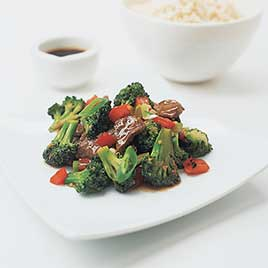
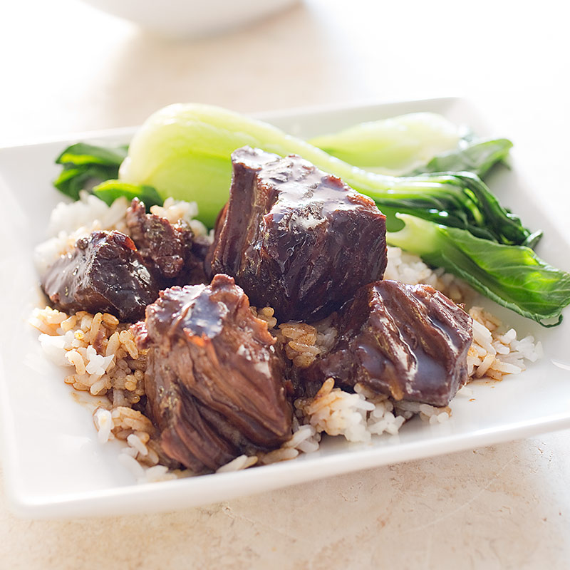
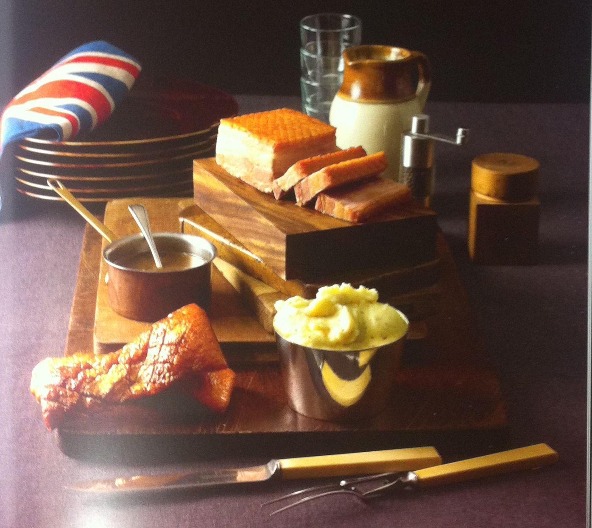
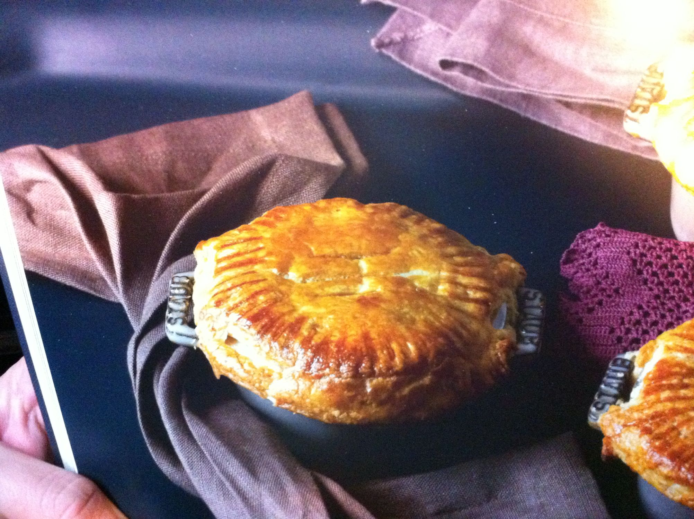

# Mains 

[Stir Fried Beef & Broccoli](#StirFriedBeefBroccoli)  
[Chinese Braised Beef](#ChineseBraisedBeef)  
[Korean Slow Cooked Beef](#KoreanSlowCookedBeef)  
[Cast Iron Steaks with Herb Butter](#CastIronSteak) 

[Braised Pork Belly](#BraisedPorkBelly)  
[Sweet & Sour Pork](#SweetSourPork)  
[Crispy Slow-Roasted Pork](#BellyCrispySlowRoastedPorkBelly)  

[Soy Chicken](#SoyChicken)  
[Crockpot Teriyaki Chicken](#CrockpotTeriyakiChicken)

[Pizza Base](#PizzaBase)  
[Pizza Dough](#PizzaDough)    
[Quick Tomato Sauce](#QuickTomatoSauce)  

[Chicken and Ham Pie](#ChickenandHamPie)  

[Pasta with Tuna](#PastaTuna)  

---

## Stir Fried Beef & Broccoli 

Serves 4

### Ingredients
---:|
	450|g|| 	Beef  
	3 |tbsp|| 	Soy Sauce  
	2 |tbsp|| 	chicken broth  
	5 |tbsp|| 	oyster sauce  
	1 |tbsp|| 	brown sugar  
	1 |tsp| |	sesame oil
	1 |tsp| |	cornstarch  
	6 |cloves|| garlic, pressed  
	2.5 |cm|| 	ginger minced  
	3 |tbsp|| 	peanut oil  
	1/2 |kg| |	broccoli  
	1 	|||	capsicum

### Method
1. Combine beef and soy sauce in medium bowl; cover with plastic wrap and refrigerate at least 10 minutes or up to 1 hour, stirring once. 
2. Meanwhile, whisk sherry, chicken broth, oyster sauce, brown sugar, sesame oil, and cornstarch in measuring cup. 
3. Combine garlic, ginger, and 1 1/2 teaspoons peanut oil in small bowl.
4. Drain beef and discard liquid. Heat 1 1/2 teaspoons peanut oil in 12-inch nonstick skillet over high heat until smoking. 
5. Add half of beef to skillet and break up clumps; cook, without stirring, for 1 minute, then stir and cook until beef is browned around edges, about 30 seconds. 
6. Transfer beef to medium bowl. Heat 1 1/2 teaspoons peanut oil in skillet, and repeat with remaining beef.
7. Add vegi's and cook, stirring frequently, until spotty brown, about 1 1/2 minutes.
8. Clear center of skillet; add garlic and ginger to clearing and cook, mashing mixture with spoon, until fragrant, 15 to 20 seconds, then stir mixture into the vegi's.
9.  Return the beef to the skillet and toss to combine. 
10.  Whisk sauce to recombine, then add to skillet; cook, stirring constantly, until sauce is thickened and evenly distributed, about 30 seconds. 

---

## Chinese Braised Beef 

With its generous amount of soy sauce, this dish is meant to taste salty, which is why we pair it with plain white rice (see related content). A simple steamed vegetable like bok choy or broccoli completes the meal. Boneless beef short ribs require little trimming, but you can also use a 4-pound chuck roast. Trim the roast of large pieces of fat and sinew, cut it across the grain into 1-inch-thick slabs, and cut the slabs into 4 by 2-inch pieces.

### Ingredients
---:|
	1 1/2 |tbsp|| 	unflavoured gelatine   
	2 1/2 |cups| |	water  
	1/2 |cup|| dry sherry  
	1/3 |cup|| 	soy sauce  
	2 |tbsp|| 		hoisin sauce  
	2 |tbsp| |		molasses  
	2 |in|| piece ginger peeled,	and crushed   
	4 |cloves||		garlic peeled and smashed   
	1 1/2 |tsp|| 	five-spice powder   
	1 |tsp|| 		red pepper flakes   
	1.3 |kg|| 	boneless beef short ribs, trimmed and cut into 4-inch lengths   
	1 |tsp| |		cornstarch 

### Method 
1. Sprinkle gelatin over 2 1/2 cups water in Dutch oven and let sit until gelatin softens, about 5 minutes. Adjust oven rack to middle position and heat oven to 300 degrees. 
2. Heat softened gelatin over medium-high heat, stirring occasionally, until melted, 2 to 3 minutes. Stir in sherry, soy sauce, hoisin, molasses, scallion whites, ginger, garlic, five-spice powder, and pepper flakes. Stir in beef and bring to simmer. Remove pot from heat. Cover tightly with sheet of heavy-duty aluminum foil, then lid. Transfer to oven and cook until beef is tender, 2 to 2 1/2 hours, stirring halfway through cooking. 
3. Using slotted spoon, transfer beef to cutting board. Strain sauce through fine-mesh strainer into fat separator. Wipe out pot with paper towels. Let liquid settle for 5 minutes, then return defatted liquid to now-empty pot. Cook liquid over medium-high heat, stirring occasionally, until thickened and reduced to 1 cup, 20 to 25 minutes. 
4. While sauce reduces, using 2 forks, break beef into 1 1/2-inch pieces. Whisk cornstarch and remaining 1 tablespoon water together in small bowl. 
5. Reduce heat to medium-low, whisk cornstarch mixture into reduced sauce, and cook until sauce is slightly thickened, about 1 minute. Return beef to sauce and stir to coat. Cover and cook, stirring occasionally, until beef is heated through, about 5 minutes. Sprinkle scallion greens over top. Serve.  

---

## Korean Slow Cooked Beef 

### Ingredients
---:|
1/2 |kg 	||Rib Eye  
	1/2 |cup ||	dark soy sauce  
	1/2 |cup 	||pear juice  
	1/4 |cup 	||rice wine  
	1 |tbsp 	|	|sesame oil  
	2 	|		||garlic cloves  
	1/4 |cup 	||brown sugar  

---

## Sweet & Sour Pork 

### Ingredients

#### Pork

	1/2 cup (70g) 	cornflour
 	1/3 cup (50g) 	plain flour
	1 teaspoon 		salt
	2 				eggs
	2 tablespoons 	water
	500g 			pork scotch fillet, 
					cut into 1.5cm pieces

#### Sweet & sour sauce

	 1 tablespoon 	peanut oil
	 1 				green capsicum, chopped
	 1 				carrot, sliced
	 1 				garlic clove, crushed
	 1/2 cup (115g) caster sugar
	 1/2 cup (125ml) white vinegar
	 1 tablespoon 	soy sauce
	 2 tablespoons 	cornflour
	 425g can 		pineapple pieces in
					natural juices, drained

### Method
1. For the sauce, heat oil in a saucepan over medium heat. Add the capsicum, carrot and garlic and cook for 3 minutes. Stir in the sugar, vinegar, soy sauce and 1 cup (250ml) water until sugar dissolves. Combine the cornflour and 2 tablespoons water. Add to the pan and whisk until it comes to the boil. Simmer for 2 minutes. Stir in the pineapple. Set aside.
2. Combine the cornflour, plain flour, salt, eggs and 2 tablespoons water. Coat half the pork in the batter. Carefully deep fry in hot oil for 3-4 minutes until golden. Repeat.
3. Combine pork and sauce. Serve with rice, shallots and coriander.

[taste.com.au](http://www.taste.com.au/recipes/15119/sweet+sour+pork)

---

## Braised Pork Belly 

### Ingredients

Serves 4  
1 Piece of pork belly, weighing approx. 500-750g

#### For the curing brine (25% brine)
  
	1 	Star anise  
	15g Coriander seeds  
	6 	Cloves  
	6 	Allspice berries  
	3 	Juniper berries  
	Zest of 1 orange  
	Zest of 1 lemon  
	1 	Sprig of rosemary  
	2 	Sprigs of thyme  
	3 	Bay leaves  
	2 	Cloves of garlic, 
		peeled and roughly chopped  
	250g Salt  

#### For braising the pork belly
  
	1 	Carrot, peeled and sliced  
	1 	Onion, peeled and sliced  
	1 	Leek, white part only, cleaned and sliced  
	1kg Brown chicken stock  
	Salt and black pepper  
	Groundnut or grapeseed oil  

### Method
1. Pre-heat the oven to 180 C.
2. Toast the spices for the brine in the oven for 10 minutes, then blitz in a spice grinder or food processor to a coarse powder. Tie them in a muslin parcel with the zest, herbs and garlic.
3. Combine 1kg cold tap water and the salt in a large saucepan, add the muslin parcel and bring to the boil over a medium heat.
4. Using a very sharp knife, carefully remove the top skin of the pork belly, trying to keep it intact. Wrap the skin in clingfilm and keep in the fridge.
5. Remove the brine from the heat, pour into a bowl and allow to cool completely. Discard the spice bundle. Place  the pork belly in the liquid, cover with clingfiIm and place in the fridge for 12 hours.
6. After 12 hours, remove the meat from the brine and soak in cold water for 1 hour, changing the water every 15 minutes. When  ready to braise the pork, preheat the oven to 70 C.
7. Place the brined pork in a large casserole with a lid, then add the vegetables and pour over the stock. Cover and cook over a medium heat until the liquid begins to simmer, then place in the Oven for 18 hours.
8. After 13 hours, put the unwrapped pork skin on a drying rack on top of a baking tray and place in the oven while the pork is slow cooking.
9. After 18 hours, remove the casserole dish and pork skin from the oven and increase the heat to 240 C.
10. Allow the braised pork to cool in the liquid. Once cool, remove the pork and set aside. Strain the liquid into a pan, discarding the vegetables.
11. Return the pork skin to the hot oven and cook for approximately 15 minutes until the skin has puffed up.
12. Set aside approximately 200g of the strained stock. Place the rest in a pan over a high heat and reduce by two-thirds. Season and keep warm.
13. When ready to eat, heat the 200g stock in a pan over a medium heat and add the pork belly, skinned-side up, being careful not to get the top wet. When warmed through (after approximately 20 minutes), remove the pork from the liquid and drain on kitchen paper.
14. Heat a thin layer of oil in a frying pan until smoking hot then place the pork belly, skinned-side down, in the pan and allow to colour for 30 seconds.
15. Combine the reduced stock with the liquid left over from warming the pork. Serve the pork in thick slices with mashed potato, sauce and a piece of the crispy skin.

[Heston at Home](https://www.librarything.com/work/11790862/book/88951785)

---

## Pizza Base

Makes 2 pizza bases

### Ingredients
---|
	1 ¾ |cup	|Water
	7g||			Dry Yeast
	1 |tbsp|		Sugar
	2 |tbsp	|	Olive Oil
	4 |cups|		Flour
	1 ½ |tsp|	Salt

### Method
1. In the bowl of a food processor fitted with either metal or plastic blade, add water and sprinkle in yeast and sugar
2. Pulse twice to dissolve yeast.
3. Add all remaining ingredients and process until mixture forms cohesive mass. Dough should not be sticky (if it is, add 2 more tablespoons flour and pulse briefly) nor should it be dry and crumbly (if it is, add 1 more tablespoons water and pulse briefly).
4. Remove dough from food processor and knead by hand on floured work surface for 1 minute or until dough is smooth and satiny (dough will feel a bit tough at this point).
5. Very lightly oil large bowl with vegetable oil or cooking spray. Place dough in bowl (do not coat dough with oil) and cover with plastic wrap. Place in warm oven. Let rise for 40 minutes or until doubled.
6. Remove from bowl, punch down, and separate into two round pieces.
7. Let rest for 10 minutes under damp dish towel
8. Flatten the dough into a disk using the palm of your hand.  
  
9. Starting at the center and working outward, use your fingertips to press the disk to about 1/4-inch thick.  
  
10. Using one hand to hold the dough in place, use your other hand to stretch the dough outward. For a medium-thick pizza crust, repeat the stretching by turning the dough a quarter turn after each pull, until it is the correct diameter. For a thinner pizza, let the dough relax for 5 minutes, then continue stretching it until it has reached the correct diameter.  

---

## Pizza Dough

### Ingredients
---|
1 ¾ |cups |water divided, ½ cup warm, remaining at tap temperature
2 ¼|tsp |dry active yeast (1 envelope)
2 | tbsp |Olive Oil, plus extra for brushing dough
4| cups | bread flour
1 ½| tsp | table salt

### Method
1. Measure ¼ cup of warm water into 2-cup measuring cup. Sprinkle in yeast; let stand until yeast dissolves and swells, about 5 minutes. 
2. Add remaining ¼ cup warm water plus remaining 1 ¼ cups tap water and olive oil. 
3. Meanwhile, pulse flour and salt in workbowl of large food processor fitted with steel blade to combine. 
4. Add liquid ingredients (holding back a tablespoon or so) to flour and pulse together. 
5. If dough does not readily form into ball, stop machine, add remaining liquid, and continue to pulse until ball forms. Process until dough is smooth and satiny, about 30 seconds longer.
2. Turn dough onto lightly floured work surface; knead by hand with a few strokes to form smooth, round ball. 
3. Put dough into medium-large, oiled bowl, and cover with damp cloth. Let rise until doubled in size, about 2 hours.
3. Turn dough out onto lightly floured work surface and use chef’s knife or dough scraper to halve, quarter, or cut dough into eighths, depending on number and size of pizzas desired. 
4. Form each piece into ball and cover with damp cloth. Working with one piece of dough at a time, shape as shown in illustrations below. 
5. Transfer to pizza peel that has been lightly coated with semolina, brush dough very lightly with olive oil before topping and cooking.
4. Use the following guide to determine cooking time for pizza crust with topping but without cheese. 
5. All pizzas need to be cooked an additional two or three minutes after adding cheese, or until cheese is completely melted.

##### THIN CRUST
---|
14-inch pizzas |(Master Recipe makes 2) | 7 to 8 minutes
12-inch pizzas |(Master Recipe makes 4) | 5 minutes  
8-inch pizzas |(Master Recipe makes 8)| 3 minutes.

##### MEDIUM-THICK CRUST
---|
12-inch pizzas |(Master Recipe makes 2) | 9 to 10 minutes 
8-inch pizzas |(Master Recipe makes 4) | 5 minutes 
6-inch pizzas |(Master Recipe makes 8) | 4 minutes.

[cooksillustrated.com](https://www.cooksillustrated.com/recipes/1043-pizza-dough)

---

## Chicken and Ham Pie

When the ingredients for a pie are cooked together for a long time, the textures and flavours tend to become bland and amorphous. Here the main components of the dish are cooked separately and bought together only right at the end.  This helps preserve the character and integrity of each ingredient.

To intensify the flavour, the chicken is placed in a brine (p. 135) and left for 5 hours, during which time you can carry on with other parts of the recipe. Two hours after the chicken goes into the brine, pre-heat the oven for the ham. After the ham has been cooking for 3 hours, you prepare the chicken and place it in the oven as well.

I really like the flavour of cooked chicken skin, but in a pie, where it’s not crisped up, it can be tough and chewy. So here the skin is removed from the chicken, rendered in a pan, and the fat is then used to soften the leeks, so you still capture that lovely chicken-skin flavour.

This pie filling is thickened using agent agar-agar, rather than a starch. But if you can't get agar-agar, use cornflour — it’ll still be very tasty. This recipe will make six individual pies, but if you prefer make a large one to serve family-style.

### Ingredients
*Serves 6*

#### For the chicken

	8%	Brine (80g salt dissolved in 1kg tap water)
	8	Boned and skinned chicken thighs (keep thw skin)
	500g Brown chicken stock (p.39)

#### For the ham

	Gammon joint, weighing approx. 1 kg
	Onion, peeled and finely sliced
	Leek, white part only, cleaned and finely sliced
	Carrot, peeled and finely sliced

#### For the leeks

	2 tbsp	Groundnut or grapeseed oil
	Chicken skin  from the thighs
	300g	Leeks, white part only, 
			cleaned and finely sliced

#### For the mustard sauce

	200g 	White wine
	225g 	Whole milk
	225g 	Double cream
	150g 	Brown chicken stock (from above)
	2 tbsp 	Agar-agar flakes (Specialist ingredients. p.394
	30g 	Dijon mustard
	40g 	Wholegrain mustard
			Salt and black pepper

#### To assemble and cook the pies

	5g 		Tarragon leaves
	10g 	Flat-leaf parsley
	250g 	All-butter puff pastry
	1 		Medium egg, lightly beaten

### Method
1. Place the brine in a bowl big enough to contain the chicken thighs. Add the chicken and leave for S hours.
2. Rinse the chicken under cold running water for S minutes, then dry with kitchen roll. Store in the fridge until needed.
3. Two hours after you have started brining the chicken, pre-heat the oven to 85 C.
4. Put the gammon joint and vegetables in an ovenproof saucepan, and pour in enough cold water to cover the meat. Put a lid on the pan and place over a medium heat.
5. Bring the water to a simmer and then place the pan in the oven for 5 hours, or until the meat flakes. Allow the meat to cool in the liquid before removing and dicing.
6.  When the gammon has been cooking for 3 hours place the brined chicken thighs in another ovenproof saucepan and cover with the chicken stock. Bring the stock to a simmer over a medium heat, then place in the oven along with the ham, for 1 hour 30 minutes.
7. Allow the chicken to cool in the liquid before removing and dicing. Keep 150g of the chicken stock for the mustard sauce that will bind the pies. (The remaining stock can be used for soups or sauces, or discarded.) 
8. Allow the chicken to cool in the liquid before removing and dicing. Keep 150g of the chicken stock for the mustard sauce that will bind the pies. (The remaining stock can be used for soups or sauces, or discarded.)
9. Meanwhile, cook the leeks. Coat the bottom of a frying pan with the oil and place the pan over a medium-high heat. Add the chicken skin and render the fat from it for 10-15 minutes. Remove the skin and discard.
10. Reduce the heat to medium and add the leeks to the fat. Cook until completely soft (approx. 15 minutes), then allow to cool in the pan.
11. Now make the mustard sauce. In the saucepan, reduce the white wine by two-thirds. Add the milk, cream and chicken stock and cook for 10 minutes over a low heat while whisking. Sprinkle the agar-agar into the pan and whisk it into the sauce. Continue to simmer for 4 minutes. Allow to cool, then blitz thoroughly with a hand blender. Return the pan to a medium heat, stir in the Dijon and wholegrain mustards, and season with salt and freshly ground pepper.
12. When ready to assemble and cook the pies, pre-heat the oven to 215 C.
13. Mix the diced ham and chicken with the mustard sauce and leeks. Finely chop the herbs, add them to the mixture and adjust the seasoning. Pour into individual pie dishes, approximately 10cm in diameter or, if you prefer, a family sized dish, approximately 28cm in length).
14. Roll the pastry out on a lightly floured surface until approximately 5mm thick. Cut out six circles slightly larger than the diameter of the pie dishes (or cut to the right size for a single pie). Leave the pastry in the fridge to rest for about 20 minutes.
15. Lay the pastry discs over the pie dishes and fold the overhang around the lip of the each dish to seal the edges.
16. Crimp the edges of the pies with a fork for decoration. Make a few holes in the middle to release the steam. Using a pastry top of the pies with the beaten egg.
17. Place in the oven for approx. 15-20 minutes or until the pastry is golden on top. (A large pie will take longer to heat through)

[Heston at Home](https://www.librarything.com/work/11790862/book/88951785)

---

## Pasta with Tuna

### Ingredients
---:|
	400|g |	Pasta
	3 |tbsp|	Olive Oil
	2 ||		cloves garlic
	1-2||		large chillies, chopped
	1-2 |tsp|	capers
	1	|	|lemon juiced
	350|g|	Tuna in olive oil
		||	Rocket leaves, large, roughly chopped

### Method
1. Cook pasta according to packet
2. Combine the olive oil, garlic, chilli, capers, lemon juice in a small bowl
3. Add tuna with oil to the bowl, gently flaking the fish.
4. Drain the pasta
5. Return pasta to the pan, then stir in the tuna mixture
6. Add extra olive oil, salt & pepper to taste

---

## Quick Tomato Sauce for Pizza

### Ingredients

---|
2 | large | cloves garlic, minced
2 | tbsp | Olive Oil
1 | can  | crushed tomatoes

### Method
If you don’t have time to cook this sauce, simply mix these ingredients together and let them stand while you stretch the dough. If you’re using crushed tomatoes or canned tomatoes packed in juice, you may want to drain off some of the liquid if you’re not cooking the sauce.

1. Heat garlic with oil in saucepan over medium heat.
2.  When garlic starts to sizzle, add tomatoes. 
3.  Simmer, uncovered, until sauce is thick enough to mound on spoon, about 15 minutes. 
4.  Season to taste with salt and pepper.

[cooksillustrated.com](http://www.cooksillustrated.com/recipes/1045-quick-tomato-sauce-for-pizza?incode=MCSCZ00L0)

---

## Crispy Slow-Roasted Pork Belly

### Ingredients
---|
1 | 1.3 kg |skin-on pork belly, about 3.8 cm thick
||Kosher Salt
2|tbsp |Packed Dark Brown Sugar
||Vegetable oil

### Method

1. Using sharp chef’s knife, slice pork belly lengthwise into 3 strips about 2 inches wide, then make 1/4-inch-deep crosswise cuts through skin and into fat spaced 1/2 inch apart. 
2. Combine 2 tablespoons salt and brown sugar in small bowl. 
3. Rub salt mixture into bottom and sides of pork belly (do not rub into skin). 
4. Season skin of each strip evenly with 1/2 teaspoon salt. 
5. Place pork belly, skin side up, in 13 by 9-inch baking dish and refrigerate, uncovered, for at least 12 hours or up to 24 hours.
2. Adjust oven rack to middle position and heat oven to 120 degrees. 
3. Transfer pork belly, skin side up, to lightly greased wire rack set in rimmed baking sheet. 
4. Roast pork belly until meat registers 90 degrees and paring knife inserted in meat meets little resistance, 3 to 3 1/2 hours, rotating sheet halfway through roasting.
3. Transfer pork belly, skin side up, to large plate. (Pork belly can be held at room temperature for up to 1 hour.) 
4. Add vegetable oil as needed to equal 1 cup and transfer to 12-inch skillet. 
5. Arrange pork belly, skin side down, in skillet (strips can be sliced in half crosswise if skillet won’t fit strips whole) and place over medium heat until bubbles form around pork belly. 
6. Continue to fry, tilting skillet occasionally to even out hot spots, until skin puffs, crisps, and turns golden, 6 to 10 minutes. 
7. Transfer pork belly, skin side up, to carving board and let rest for 5 minutes. 
8. Flip pork belly on its side and slice 1/2 inch thick (being sure to slice through original score marks). 
9. Reinvert slices and serve.

[cooksillustrated.com](http://www.cooksillustrated.com/recipes/8116-crispy-slow-roasted-pork-belly)

---

## Finger licken chicken

### Ingredients
---|
1|kg | chicken thighs
8 |tbsp |soy sauce
4 |tbsp |honey
2 |tsp |garlic purée or chopped garlic
4 |tsp |tomato sauce
||Salt and pepper

### Method
1. Combine ingedients
2. Place chicken in the slow cooker
3. Pour sauce over chicken
4. Cook on low for 4 hours
5. Sprinkle sesame seeds over chicken

[slowcookercentral.com](http://www.slowcookercentral.com/recipe/finger-licken-chicken/)

---

## Crockpot Teriyaki Chicken

### Ingredients
---|
1 |kg || Skinless Chicken thighs
1/3 |cup ||Soy Sauce
1/3 |cup ||Water
1 |clove ||Garlic, minced
1 |tsp ||Grated Ginger
2 |tbsp ||Brown Sugar
2 |tbsp || Honey
2 |tbsp || Rice Vinegar
1 |tbsp || Mirin
1/4 |tsp ||Sesame Oil
2 |tbsp || Cornstarch
2 |tbsp || Water

### Method

1. In a small measuring cup or small bowl, whisk together the soy sauce, water, brown sugar, garlic, ginger, rice vinegar, mirin and sesame oil.
2. Place the chicken in the Crock Pot, add the sauce on top, place a lid on and cook on high for about 4 hours or low for 6 to 8 hours.
3. If you’re adding the veggies to this, do so at the very last 45 minutes of cooking to prevent them for getting too soggy.
4. When ready, remove the chicken and veggies, place the sauce in a skillet, heat it over medium heat. Meanwhile, in a small bowl mix together the water and cornstarch, add it to the simmering sauce, cook for a few minutes or until it thickens, stir it with the chicken and veggies and serve over rice.

[laurainthekitchen.com](http://www.laurainthekitchen.com/recipes/crockpot-teriyaki-chicken/)

---

## Cast Iron Steaks with Herb Butter {#CastIronSteak}

To pan-sear a thick-cut steak, we turned to a cast-iron skillet since its heat-retention properties are ideal for a perfect sear. We chose the moderately expensive boneless strip steak for its big, beefy flavor. But when we tried preheating the skillet on the stovetop, cast iron’s uneven heat distribution properties created an equally uneven sear on our steaks. As a result, we ended up preheating the skillet in the oven. To get a perfectly even sear, we used quite a large amount (2 tablespoons) of oil, since this meant that the steaks’ surfaces remained in contact with the heat even as the steaks unevenly contracted during cooking. We started out flipping our steaks only once, halfway through cooking. But we found that flipping the steaks more often led to a shorter cooking time and a smaller gray band of dry, overcooked meat just under the surface of the steaks. After testing different flipping techniques and heating levels, we found that flipping the steaks every 2 minutes and transitioning from medium-high to medium-low heat partway through cooking resulted in a perfectly browned, crisp crust and a juicy, evenly cooked interior every time.

### Ingredients

---:|
2 ||| (450g) boneless strip steaks, 4 cm thick, trimmed
||| Salt and pepper
4|tbsp|| Unsalted Butter, softened
2|tbsp|| minced shallots
1|tbsp|| minced fresh parsley
1|tbsp|| minced fresh chives
1 |||garlic clove, minced
2|tbsp|| Vegetable Oil

### Method
*Don’t forget to take the butter out to soften at least 30 minutes before you start to cook.*

1. Adjust oven rack to middle position, place 12-inch cast-iron skillet on rack, and heat oven to 260°C. 
2. Season steaks with salt and let sit at room temperature. 
3. Combine butter, shallot, parsley, chives, garlic, and 1/4 teaspoon pepper in bowl; set aside.
2. When oven reaches 260°C, pat steaks dry with paper towels and season with pepper. Using potholders, remove skillet from oven and place over medium-high heat; turn off oven. Being careful of hot skillet handle, add oil and heat until just smoking. 
3. Cook steaks, without moving them, until lightly browned on first side, about 2 minutes. Flip steaks and cook until lightly browned on second side, about 2 minutes.
3. Flip steaks, reduce heat to medium-low, and cook, flipping every 2 minutes, until steaks are well browned and meat registers 49°C to 52°C (for medium-rare), 7 to 9 minutes. 
4. Transfer steaks to carving board, dollop 2 tablespoons herb butter on each steak, tent with aluminum foil, and let rest for 5 to 10 minutes. Slice steaks 1.25cm thick and serve.

[Cooks Illustrated](https://www.cooksillustrated.com/recipes/9249-cast-iron-steaks-with-herb-butter)

