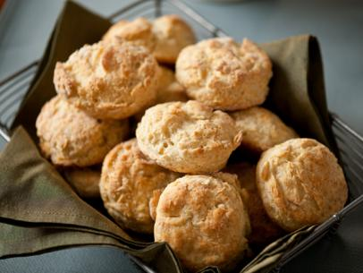
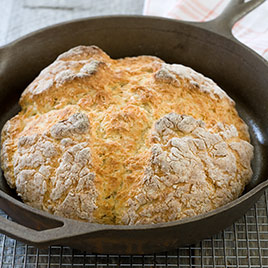
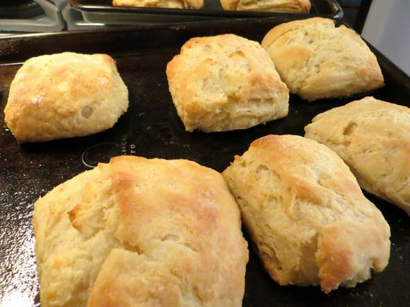
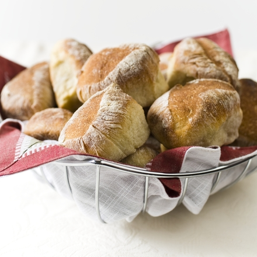
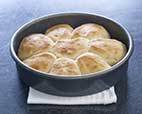
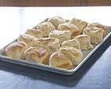
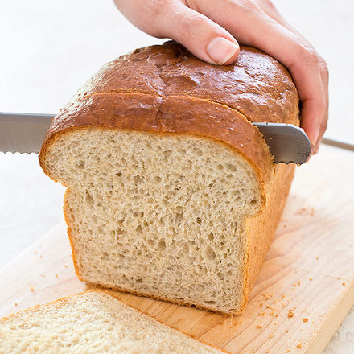

# Sides 

[Southern Biscuits](#SouthernBiscuits)  
[Angel Biscuits](#AngelBiscuits) 
 
[Soda Bread](#SodaBread)  
[Cob Loaf](#CobLoaf)  
[Rustic Dinner Rolls](#RusticDinnerRolls)   
[Easy Sandwich Bread](#EasySandwichBread)  
[Chapati](#Chapati)  

---

## Southern Biscuits

### Ingredients
---:|
2 |cups | |flour 
4 |tsp	||baking powder 
1/4 |tsp ||baking soda 
3/4 |tsp ||salt 
2 |tbsp |	|butter 
2 |tbsp || shortening 
1 |cup | |	buttermilk, chilled

### Method
 
1. In a large mixing bowl, combine flour, baking powder, baking soda and salt. Using your fingertips, rub butter and shortening into dry ingredients until mixture looks like crumbs. (The faster the better, you don't want the fats to melt.) 
2. Make a well in the center and pour in the chilled buttermilk. Stir just until the dough comes together. The dough will be very sticky.
3. Turn dough onto floured surface, dust top with flour and gently fold dough over on itself 5 or 6 times. 
4. Press into a 1-inch thick round. Cut out biscuits with a 2-inch cutter, being sure to push straight down through the dough. 
5. Place biscuits on baking sheet so that they just touch. Reform scrap dough, working it as little as possible and continue cutting. (Biscuits from the second pass will not be quite as light as those from the first, but hey, that's life.)
6. Bake until biscuits are tall and light gold on top, 15 to 20 minutes. 

[Food Network](http://www.foodnetwork.com/recipes/alton-brown/southern-biscuits-recipe.html)

---

## Soda Bread

### Ingredients
---:|
375 |g	||	all-purpose flour
127 |g	||	cake flour
1 1/2 |tsp|	|baking soda
1 1/2 |tsp| 	|cream of tartar
1 1/2 |tsp| |	salt
2 |tbsp |	|	sugar
2 |tbsp |	|	unsalted butter, softened
360|mL| |		low-fat buttermilk
1 |tbsp |	|	melted butter, optional

### Method

1. Heat the oven to 200 degrees and adjust a rack to the centre position. 
2. Place the flours, soda, cream of tartar, salt and sugar in a large mixing bowl. Add the butter and rub it into the flour using your fingers until it is completely incorporated and the mixture resembles coarse crumbs. 
3. Make a well in the centre and add the buttermilk. Work the liquid into the flour mixture using a fork until the dough comes together in large clumps. 
4. Turn the dough onto a work surface and knead briefly until the loose flour is just moistened. The dough will still be scrappy and uneven.
5. Form the dough into a round about 6 to 7 inches in diameter and place in a cast iron skillet. Score a deep cross on top of the loaf and place in the heated oven. 
6. Bake until nicely browned and a tested comes out clean when inserted into the centre of the loaf, about 40 to 45 minutes. 
7. Remove from oven and brush with a tablespoon of melted butter if desired. Cool for at least 30 minutes before slicing. Serve slightly warm or at room temperature.

[Cooks Illustrated](https://www.cooksillustrated.com/recipes/4071-skillet-soda-bread)

---

## Cob Loaf

### Ingredients

---:|
7|g  ||	dry yeast
2 |tsp |	|caster sugar
1 |cup |	|warm water
3 |cups| |bread flour
1 |tsp|| 	sea salt
1 |tbsp| |	Bertolli olive oil
1 | | |egg, 	lightly beaten
|||Extra bread flour, for dusting

### Method
1. Place yeast, sugar and warm water in a jug. Whisk with a fork until yeast has dissolved. Stand in a warm place for 10 minutes or until frothy.
2. Sift flour into a large bowl. Stir in salt, yeast mixture and olive oil. Mix to form a soft dough. Turn out onto a lightly floured surface. Knead dough for 10 to 15 minutes or until smooth and elastic. Place in a large, lightly greased bowl. Cover and set aside in a warm place for 1 hour or until doubled in size.
3. Using your fist, punch dough down. Knead until smooth.
4. Grease a baking tray well with olive oil cooking spray or olive oil. Shape dough into a 15cm round loaf. Place on prepared tray. Cut a shallow criss-cross pattern in centre of dough.
5. Cover with lightly greased plastic wrap. Set aside in a warm place for 30 to 40 minutes or until dough has almost doubled in size. Meanwhile, preheat fan-forced oven at 200°C/180°C. Brush dough top with egg.
6. Dust with extra flour. Bake for 35 to 40 minutes. Turn bread, top side up, onto a wire rack to cool. Serve at room temperature.

[Taste](http://www.taste.com.au/recipes/24208/cob+loaf)

---

## Angel Biscuits

 *25 to 30 biscuits*

### Ingredients
---:|
4 ½ |tsp || instant yeast or two ¼-ounce packets active dry yeast
5 |cups ||all-purpose flour
¼ |cup ||sugar
4 |tsp ||baking powder
1½ |tsp ||salt
1 |tsp| |baking soda
225|g  | |cold unsalted butter
2 |cups ||buttermilk

### Method
1. Heat the oven to 220°C. 
2. Combine the yeast with ¼ cup warm water—about the same temperature as the inside of your wrist—in a small bowl. Let sit for 5 minutes.
2. Meanwhile, combine the flour, sugar, baking powder, salt, and baking soda in a large bowl. 
3. Add 1 cup (2 sticks) of the butter and blend with a pastry cutter or your fingers until the mixture resembles coarse crumbs. 
4. Add the buttermilk and the yeast mixture and stir just until combined, then transfer the dough to a floured surface and knead 5 or 6 times.
3. With a rolling pin, roll out the dough until it’s ¾ inch thick. 
4. Cut into rounds with a biscuit cutter or glass and transfer to an ungreased baking sheet with the edges of the rounds touching. 
5. Gather up the dough scraps, roll them out, and repeat. 
6. Cover the pan with a clean kitchen towel or plastic wrap and let the dough rest for at least 10 minutes.
4. Melt the remaining 2 tablespoons butter in a small saucepan over medium-low heat (or in a microwave-safe bowl in the microwave). 
5. Brush the biscuits with the melted butter. 
6. Bake until the biscuits are golden brown, 10 to 15 minutes. 
7. Serve hot or warm.

[slate.com](http://www.slate.com/blogs/browbeat/2014/11/26/angel_biscuits_recipe_a_thanksgiving_cross_between_biscuits_and_bread.html)

---

## Chapatis

### Ingredients

---:|
2 |tbsp|| salt
2 |tbsp|| sugar
¼ |cup|| oil
1 |kg|| flour
1 |cup?|| hot water

Makes 18

#### Method
1. Combine ingredients, mix until smooth and non sticky
2. Divide dough into small fist sized balls
3. Roll dough into a circle with a rolling pin
4. Heat large flat frying pan on high heat
4. Add a tsp of oil to the frying pan
5. Use hand  to squash the chapati, place hand in middle and spread out all fingers to stretch dough.
6. Lift up chapati and add oil to centre of pan, than use chapati to spread oil.
7. After flipping use already cooked chapati to squash, and speed up cooking. 

---

## Rustic Dinner Rolls {#RusticDinnerRolls}

To get a flavorful dinner roll recipe with a crisp crust and chewy crumb without a steam-injected oven, we replaced a few tablespoons of bread flour with whole-wheat flour and added honey. For an airy crumb, we determined exactly how much water and yeast would produce bubbly yet shapely rolls. A two-step baking process—baking the rolls in a cake pan to set their shape before pulling them apart to crisp up—gave our rustic dinner roll recipe the crust we were looking for.

### Ingredients

---:|
1 ½|cups|| water, room temperature (12 ½ ounces)
1 |tbsp ||water, room temperature
1 ½|tsp|| instant or rapid-rise yeast
2|tsp|| honey
3|cups|| bread flour (16 ½ ounces)
3|tbsp|| Whole-Wheat Flour (about 1 ounce)
1 ½|tsp ||table salt

### Method
1. Whisk water, yeast, and honey in bowl of stand mixer until well combined, making sure no honey sticks to bottom of bowl. 
2. Add flours and mix on low speed with dough hook until cohesive dough is formed, about 3 minutes. 
3. Cover bowl with plastic wrap and let sit at room temperature 30 minutes.
2. Remove plastic wrap and evenly sprinkle salt over dough. 
3. Knead on low speed (speed 2 on KitchenAid) 5 minutes. (If dough creeps up attachment, stop mixer and scrape down using well-floured hands or greased spatula.) 
4. Increase speed to medium and continue to knead until dough is smooth and slightly tacky, about 1 minute. If dough is very sticky, add 1 to 2 tablespoons flour and continue mixing 1 minute. 
5. Lightly spray 2-quart bowl with nonstick cooking spray; transfer dough to bowl and cover with plastic wrap. Let dough rise in warm, draft-free place until doubled in size, about 1 hour.
6. Fold dough over itself; rotate bowl quarter turn and fold again. Rotate bowl again and fold once more. 
7. Cover with plastic wrap and let rise 30 minutes. 
8. Repeat folding, replace plastic wrap, and let dough rise until doubled in volume, about 30 minutes. 
9. Spray two 9-inch round cake pans with nonstick cooking spray and set aside.
10. Transfer dough to floured work surface, sprinkle top with more flour. Using bench scraper, cut dough in half and gently stretch each half into 16-inch cylinders. 
11. Divide each cylinder into quarters, then each quarter into 2 pieces (you should have 16 pieces total), and dust top of each piece with more flour. 
12. With floured hands, gently pick up each piece and roll in palms to coat with flour, shaking off excess, and place in prepared cake pan. 
13. Arrange 8 dough pieces in each cake pan, placing one piece in middle and others around it, with long side of each piece running from center of pan to edge and making sure cut-side faces up. 
14. Loosely cover cake pans with plastic wrap and let rolls rise until doubled in size, about 30 minutes (dough is ready when it springs back slowly when pressed lightly with finger). 
15. Thirty minutes before baking, adjust rack to middle position and heat oven to 260°C.
16. Remove plastic wrap from cake pans, spray rolls lightly with water, and place in oven. 
17. Bake 10 minutes until tops of rolls are brown; remove from oven. 
18. Reduce oven temperature to 205°C; 
19. Using kitchen towels or oven mitts, invert rolls from both cake pans onto rimmed baking sheet. 
20. When rolls are cool enough to handle, turn right-side up, pull apart, and space evenly on baking sheet. 
21. Continue to bake until rolls develop deep golden brown crust and sound hollow when tapped on bottom, 10 to 15 minutes; rotating baking sheet halfway through baking time. 
22. Transfer rolls to wire rack and cool to room temperature, about 1 hour.

### Technique

For uniformly crisp, golden rolls, we devised a two-step baking process.

1. Partially baking the rolls in a cake pan helps set their shape but leaves soft spots where they touch.

2. Separating the rolls and returning them to the oven on a baking sheet ensures finished rolls that are golden and crisp all around.

[Cooks Illustrated](https://www.cooksillustrated.com/recipes/4519-rustic-dinner-rolls?ref=new_search_experience_5&incode=MCSCD00L0)

---

## Easy Sandwich Bread {#EasySandwichBread}

We knew that hastily made yeast breads can sometimes lack the structure necessary for a satisfactory rise, and their interiors are often coarse and craggy. Our goal was to make a soft, well-risen, even-crumbed loaf of bread without kneading or shaping, from start to finish in less than 2 hours.

To encourage maximum gluten structure, we used high-protein bread flour instead of all-purpose flour. We also reduced the fat and sugar slightly and withheld salt until the second mix, which gave our bread more spring and lift.

Switching our mixer’s dough hook for a paddle and increasing the speed to medium not only shortened our mixing time but also gave our dough enough structure to rise into a pleasing dome shape, which we highlighted with a shiny egg wash before baking and brushed with a thin coat of melted butter after.

*The test kitchen’s preferred loaf pan measures 8 1/2 by 4 1/2 inches; if using a 9 by 5-inch pan, check for doneness 5 minutes early. To prevent the loaf from deflating as it rises, do not let the batter come in contact with the plastic wrap. This loaf is best eaten the day it is made, but leftovers may be wrapped in plastic wrap and stored for up to two days at room temperature or frozen for up to one month.*

### Ingredients

---:|
2|cups|| (310g) bread flour
6|tbsp|| (55g) Whole-Wheat Flour
2 ¼|tsp|| instant or rapid-rise yeast
1 ¼|cups|| plus 2 tablespoons warm water (50°C)
3|tbsp|| Unsalted Butter, melted
1|tbsp|| honey
¾|tsp|| salt
1 |||large egg, lightly beaten with 1 teaspoon water and pinch salt

### Method
1. In bowl of stand mixer, whisk bread flour, whole-wheat flour, and yeast together. 
2. Add 1¼ cups warm water, 2 tablespoons melted butter, and honey. 
3. Fit stand mixer with paddle and mix on low speed for 1 minute. 
4. Increase speed to medium and mix for 2 minutes. Scrape down bowl and paddle with greased rubber spatula. Continue to mix 2 minutes longer. 
5. Remove bowl and paddle from mixer. Scrape down bowl and paddle, leaving paddle in batter. Cover with plastic wrap and let batter rise in warm place until doubled in size, about 20 minutes.
6. Adjust oven rack to lower-middle position and heat oven to 190°C. 
7. Spray 8½ by 4½-inch loaf pan with vegetable oil spray. 
8. Dissolve salt in remaining 2 tablespoons warm water. 
9. When batter has doubled, attach bowl and paddle to mixer. Add salt-water mixture and mix on low speed until water is mostly incorporated, about 40 seconds. 
10. Increase speed to medium and mix until thoroughly combined, about 1 minute, scraping down paddle if necessary.
11.  Transfer batter to prepared pan and smooth surface with greased rubber spatula. Cover and leave in warm place until batter reaches ½ inch below edge of pan, 15 to 20 minutes. 
12.  Uncover and let rise until center of batter is level with edge of pan, 5 to 10 minutes longer.
13.  Gently brush top of risen loaf with egg mixture. 
14.  Bake until deep golden brown and loaf registers 98°C to 99°C, 40 to 45 minutes. 
15.  Using dish towels, carefully invert bread onto wire rack. Reinvert loaf and brush top and sides with remaining 1 tablespoon melted butter. 
16.  Let cool completely before slicing.

[Cooks Illustrated](https://www.cooksillustrated.com/recipes/7671-easy-sandwich-bread?ref=new_search_experience_166&incode=MCSCD00L0)

