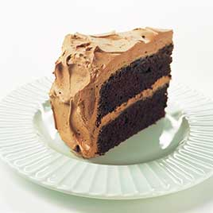
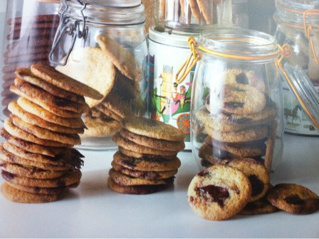
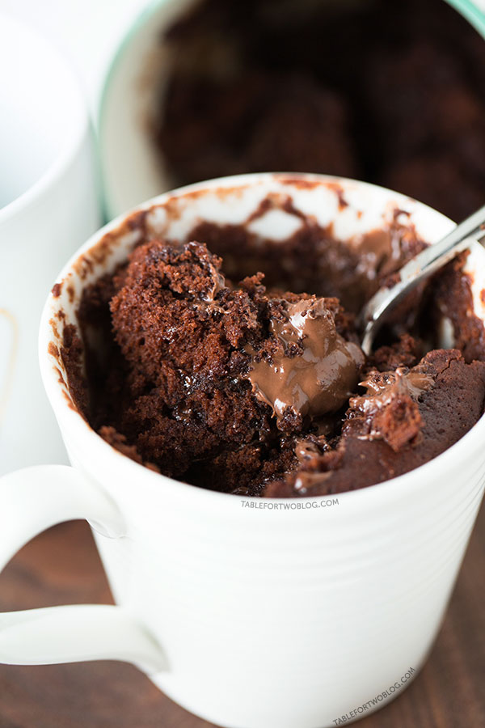
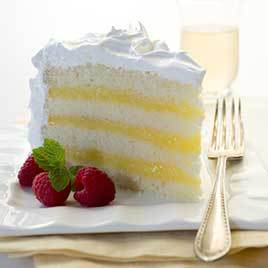
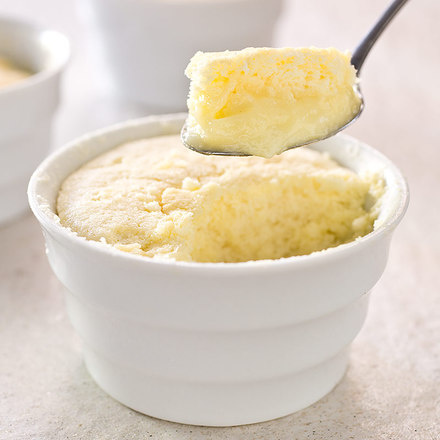

# Sweets 

[Paleo Chocolate Mug Cake](#PaleoChocolateMugCake)  
[Moistest Chocolate Mug Cake](#MoistestChocolateMugCake)      
[Chocolate Layer Cake](#ChocolateLayerCake)  
[Red Velvet Cake](#RedVelvet)  
[Plain Sponge](#PlainSponge)  
[Exploding Chocolate Gateau](#ExplodingChocolateGateau)  
[Donuts](#Donuts)  

[Chocolate Cookie](#ChocolateCookie)  
[Shortbread](#Shortbread)  
[Toasted Coconut Quinoa Breakfast Cookies](#QuinoaCookies)  
[Chocolate Crinkle Cookies](#ChocolateCrinkleCookies)  

[Liquid centre chocolate pudding](#Liquidcentrechocolatepudding)  
[Lemon Pudding Cakes](#LemonPuddingCakes)  

[Butterscotch Sauce](#ButterscotchSauce)      
[Chocolate Mousse](#ChocolateMousse)  

[Vanilla Frosting](#VanillaFrosting)  
[Fluffy Vanilla Frosting](#FluffyVanillaFrosting)  

---

## Paleo Chocolate Mug Cake

### Ingredients
This recipe makes one serving.  

---:|
1 | tbsp | almond flour  
1 |tbsp |	cocoa powder  
1 |tbsp |	almond milk
½ |tbsp |honey  
1 |	|	egg  
1 |tsp 	|vanilla extract  

### Method
1. It really is so delightfully simple! Mix all ingredients together in a mug and microwave for 1-1.5 minutes.
2. Serve with your favorite nut butter or ice cream and enjoy!

[Paleo Grub](http://paleogrubs.com/paleo-chocolate-mug-cake)

---

## Chocolate Layer Cake 

The mixing method was the key to getting the right texture for our chocolate layer cake recipe. After trying both creaming and "reverse creaming," we turned to ribboning: whipping eggs with sugar until they double in volume, then adding the butter, dry ingredients, and milk. The egg foam aerated the cake, giving it both the structure and the tenderness that neither creaming nor reverse creaming could provide. To give our open-crumbed cake rich chocolate flavor, we simply melted unsweetened chocolate and cocoa powder in hot water over a double boiler, then stirred in sugar until it dissolved before adding the chocolate mixture to the batter.

### Ingredients

	170g	 	butter  
	220g	 	plain flour  
	115g	 	chocolate  
	30g 		cocoa  
	1/2 cup 	hot water  
	350g		sugar  
	1 1/2 tsp 	baking soda  
	1 tsp 		salt  
	1 cup 		buttermilk  
	2 tsp 		vanilla extract  
	4 large 	eggs  
	2 large 	egg yolks

### Method
1. Adjust oven rack to middle position; heat oven to 175 degrees. Grease two 9-inch-round by 2-inch-high cake pans with softened butter; dust pans with flour and knock out excess. 
2. Combine chocolate, cocoa powder, and hot water in medium heatproof bowl; set bowl over saucepan containing 1 inch of simmering water and stir with rubber spatula until chocolate is melted, about 2 minutes. 
3. Add 1/2 cup sugar to chocolate mixture and stir until thick and glossy, 1 to 2 minutes. Remove bowl from heat and set aside to cool.
2. Whisk flour, baking soda, and salt in medium bowl. 
3. Combine buttermilk and vanilla in small bowl. 
4. In bowl of standing mixer fitted with whisk attachment, whisk eggs and yolks on medium-low speed until combined, about 10 seconds. 
5. Add remaining 1 1/4 cups sugar, increase speed to high, and whisk until fluffy and lightened in color, 2 to 3 minutes. 
6. Replace whisk with paddle attachment. Add cooled chocolate mixture to egg/sugar mixture and mix on medium speed until thoroughly incorporated, 30 to 45 seconds, pausing to scrape down sides of bowl with rubber spatula as needed. 
7. Add softened butter one tablespoon at a time, mixing about 10 seconds after each addition. 
8. Add about one-third of flour mixture followed by half of buttermilk mixture, mixing until incorporated after each addition (about 15 seconds). Repeat using half of remaining flour mixture and all of remaining buttermilk mixture (batter may appear separated). Scrape down sides of bowl and add remaining flour mixture; mix at medium-low speed until batter is thoroughly combined, about 15 seconds. 
9. Remove bowl from mixer and fold batter once or twice with rubber spatula to incorporate any remaining flour. Divide batter evenly between prepared cake pans; smooth batter to edges of pan with spatula.
3. Bake cakes until toothpick inserted into center comes out with a few crumbs attached, 25 to 30 minutes. 
4. Cool cakes in pans 15 minutes, then invert onto wire rack. Cool cakes to room temperature before frosting, 45 to 60 minutes.

[Cooks Illustrated](http://www.cooksillustrated.com/recipes/2905-old-fashioned-chocolate-layer-cake)

---

## Donuts

Original recipe makes 2 dozen doughnuts

### Ingredients
---:|
	120|ml |	warm water
	14|g 	|active dry yeast
	4|g| 		white sugar
	180|ml| 	milk, lukewarm
	70|g| 	vegetable shortening
	50|g| 	white sugar
	6|g| 		salt
	2 ||		eggs
	500|g| 	sifted all-purpose flour

### Method 
1. Pour ½ cup of warm water into a small bowl, and stir in the yeast and 1 teaspoon of sugar. Allow the yeast mixture to stand until it forms a creamy foam layer on top, 5 to 10 minutes.
2. Place milk and vegetable shortening into a small saucepan over medium-low heat and cook until the shortening has melted and the milk has tiny bubbles around the edge. Remove from heat.
3. Place 1/4 cup of sugar and the salt into the work bowl of a large stand mixer and pour the milk and shortening into the bowl. Mix on low speed just to dissolve sugar; and allow mixture to stand until warm.
4. Beat in the yeast mixture, eggs, and 1 cup of flour on low speed until smooth. Gradually beat in remaining flour to make a soft dough. Continue beating the dough on low speed until dough leaves the sides of the bowl, 2 to 3 minutes.
5. Turn the dough out onto a well-floured work surface and knead until smooth and elastic, 2 or 3 more minutes.
6. Form the dough into a ball and place into a large greased bowl. Grease the top of the dough, and cover the bowl with waxed paper. Set the bowl into a warm place; let the dough rise until doubled in size, 1 to 1 1/2 hours.
7. Punch down the dough and roll out on a floured work surface to ½ inch thick. Cut doughnuts out of the dough with a 3 1/2-inch round doughnut cutter with a 1-inch smaller cutter in the center. Let the doughnuts rise on the work surface until very light and fluffy, 40 minutes to 1 hour.
8. Heat oil in a deep-fryer or large saucepan to 175 degrees C.
9. Gently pick up and drop the doughnuts into the hot oil, working in small batches of 2 or 3 at a time, and cook until the doughnuts are light golden brown, turning once, about 2 minutes.

[allrecipes.com](http://allrecipes.com/recipe/my-moms-raised-doughnuts/detail.aspx?scale=24&ismetric=1)

---

## Chocolate Cookie

Although they use cocoa instead of chocolate, these biscuits are crisp, crumbly and have a lovely concentrated chocolate flavour. To make them even more indulgent, add the golden syrup chocolate chips on p.360 towards the end of mixing for a double choc chip biscuit.

The dough can be frozen in individual portions and baked for surprise guests.

### Ingredients

Makes approx. 20 biscuits

---:|
	135|g| 	Plain flour
	10|g| 	Cocoa powder
	1/2 |tsp|	Bicarbonate of soda
	1/2 |tsp|	Salt
	115|g| 	Cold unsalted butter, cubed
	130|g| 	Unrefined caster sugar

### Method

1. Pre-heat the oven to 190C.
2. Sift the flour, cocoa powder, bicarbonate of soda and salt together into a bowl, and set to one side.
3. Using a mixer fitted with the paddle attachment, cream the butter and sugar on medium speed until the mixture becomes light and fluffy (approximately 5 minutes).
4. Reduce the speed of the mixer to low, then add the flour mixture to the mixing bowl. Continue to mix until the dough comes together.
5. Using an ice-cream scoop, portion the dough into balls (approximately 40g per ball). Place them on a parchment lined baking tray roughly 10cm apart.
6. Place the tray in the oven for 10 minutes.
7. Allow to cool on the tray for 2 minutes before placing the biscuits on a cooling rack to cool completely.
8. The biscuits will keep for up to 5 days in an airtight tin.

[Heston at Home](https://www.librarything.com/work/11790862/book/88951785)

---

## Liquid centre chocolate pudding

The traditional way to make a chocolate pudding with a runny centre is by baking a mixture of eggs, butter, sugar, chocolate and a little flour until the outside forms a crust but the inside remains gooey. This recipe takes a completely different approach, putting a frozen chocolate ganache inside the cake mixture. This ensures that the centre melts to the perfect runny consistency at exactly the point when the exterior is cooked through. If you want to skip making the ganache, you could use a scoop of good-quality chocolate ice-cream instead.

Serves six

### Ingredients

#### For the water ganache

	310g 	Whipping cream
	325g 	Dark chocolate, chopped
	50g 	Unsalted butter

#### For the pudding mix

	240g 	Dark chocolate, chopped 
	225g 	Unsalted butter
	100g 	Plain flour
	1⁄2 tsp Salt
	350g 	Eggs
	150g 	Unrefined caster sugar

### Method

#### For the water ganache

1. place 110g cold tap water and the cream in a saucepan over a medium heat and bring to a simmer.
2. In the meantime, place the chocolate in a bowl over a pan of simmering water and allow it to melt completely.
3. Once the chocolate has melted, add the water and cream mixture to it in three additions and mix thoroughly with a spatula after each addition. 4. Stir in the butter. Allow to stand until it reaches room temperature, then stir one more
time.
5. Pour the ganache into a deep-sided container until it reaches 3cm deep. Place the tray in the freezer for two hours or until fully set. 
1. Meanwhile, have ready six 5cm diameter ramekins.
7. Using a 2cm ring cutter, cut cylinders out of the ganache, and place one in the centre of each ramekin. Return to the freezer.

#### For the pudding mix

1. place the chocolate and the butter in a bowl over a pan of simmering water and melt completely. 
2. Remove from the heat and allow to cool.
3. In the meantime, sieve the flour and salt together into a bowl. When the chocolate is cool, add the flour and salt and mix thoroughly.
4. Using a mixer fitted with the whisk attachment, whisk the eggs and sugar for approximately eight to 10 minutes or until light and creamy.
5. Fold a third of the egg mixture into the chocolate, being as gentle as possible. 
6. Add the remaining egg mixture and fold until well combined.
7. Half fill each ramekin with the mix and tap the ramekin a few times on the work surface to ensure any big air bubbles disappear, then continue to fill to the top. Place the ramekins back in the freezer for 1 hour.

**To Serve**

1. Pre-heat the oven to 180C. 
3. Bake for 15-18 minutes until the pudding mix is fully set. Serve immediately.

[Heston at Home](https://www.librarything.com/work/11790862/book/88951785)

---

## The Moistest Chocolate Mug Cake

### Ingredients
---:|
	1/4 |cup|		self raising flour
	2 |tbsp|		cocoa powder
	1/4 |cup|		milk
	2 |tbsp|		vegetable oil
	1 |tbsp|		chocolate spread

### Method

1. In a medium bowl, whisk together dry ingredients.
2. Whisk in the milk and vegetable oil until all ingredients are combined and batter has no clumps.
3. Pour batter into a microwave-safe mug. Mine was a 14-ounce mug. You want enough head space for the cake to rise without pouring over.
4. Add 1 tbsp. of hazelnut chocolate spread in the middle of the batter. Just drop it in the middle, no need to push it down and sink it in the batter.
5. Place a paper towel into the microwave and set the mug on top (this is to catch any batter if your mug cake overflows).
6. Microwave mug cake for 70 seconds on high
7. Carefully remove from microwave and enjoy!

[Table for Two](http://www.tablefortwoblog.com/the-moistest-chocolate-mug-cake)

---

## Red Velvet Cake

### Ingredients

	155g	all-purpose flour
	115g	cake flour
	14g		natural cocoa
	1 tsp	baking soda
	1/2 tsp salt
	240ml	buttermilk, room temperature
	30ml 	red liquid food coloring
	1 tbsp 	white vinegar
	1 tsp 	vanilla extract
	300g	dark brown sugar
	115g	unsalted butter, room temperature
	2 		eggs

### Method

1. Set a rack in the middle of the oven and preheat to 160 C.
2. Whisk the flours, cocoa, baking soda, and salt together in a bowl and set aside. Whisk the buttermilk, food coloring, vinegar, and vanilla together in a small bowl and set aside.
3. Combine the brown sugar and butter in the bowl of a stand mixer with the paddle attachment and cream on medium speed until lightened in color, 2 minutes. Stop the mixer and scrape down the sides of the bowl with a spatula. Return the mixer to medium speed and slowly add the eggs and beat until they are fully incorporated.
4. With the mixer on low, add the flour mixture in 3 installments, alternating with the buttermilk mixture, beginning and ending with the flour mixture. Stop the mixer and scrape down the sides of the bowl between each installment. Mix on low speed until smooth, 30 to 45 seconds.
5. Divide the batter evenly between the prepared pans and bake until the cake springs back when pressed or reaches an internal temperature of 95 C, 30 to 35 minutes.
6. Cool in the pans on a rack for 10 minutes, and then remove the cake from the pans and cool completely, about 1 hour, before frosting.

---

## Vanilla Frosting 

This makes enough frosting for a two-layer, 8- or 9-inch cake or a 9 by 13-inch sheet cake. For a three-layer cake, increase the heavy cream to 3 tablespoons, the butter to 3 sticks, and the confectioners' sugar to 3 cups. Be sure to use unsalted butter here or your frosting will taste salty.

### Ingredients
---:|
	2 |tbsp|	Heavy Cream
	1 |tsp|	Vanilla Extract
		||	Pinch Salt
	280|g| 	Butter
	315|g|	Icing Sugar

### Method
1. Stir the cream, vanilla, and salt together in a small bowl until the salt dissolves. 
2. Beat the butter with an electric mixer on medium-high speed until smooth, 30 to 60 seconds. 
3. Reduce the speed to medium-low, slowly add the confectioners' sugar, and beat until smooth, 2 to 5 minutes. 
4. Beat in the cream mixture. Increase the speed to medium-high and beat until the mixture is light and fluffy, 4 to 8 minutes.

[Cooks Illustrated](http://www.cooksillustrated.com/recipes/3020-quick-and-rich-vanilla-frosting?incode=MCSCZ00L0)

---

## Fluffy Vanilla Frosting

The traditional seven-minute icing recipe was a little too sweet and thick for our taste, and it required holding a hand-held mixer longer than was comfortable. So we started by cutting the sugar in our icing recipe. We learned that if we first heated the mixture to at least 160 degrees and then transferred it to the stand mixer for whipping (rather than holding a hand mixer for seven minutes), our new seven-minute icing recipe was just as billowy and shiny as the old-fashioned version.

### Ingredients
---:|
	2||		Large egg whites
	200|g|	White Sugar
	60|ml|	Water
	1 |tsp|	Vanilla Extract
	1 |tbsp|	Corn Syrup

### Method

1. Combine all ingredients in bowl of standing mixer or large heatproof bowl 
2. Set over medium saucepan filled with 2.5 cm of barely simmering water (do not let bottom of bowl touch water). 
3. Cook, stirring constantly, until sugar is dissolved and mixture registers 160 degrees on instant-read thermometer, 5 to 10 minutes. 
4. Remove bowl from heat and transfer mixture to standing mixer fitted with whisk attachment. 
5. Beat on medium speed until soft peaks form, about 5 minutes. 
6. Increase speed to medium-high and continue to beat until mixture has cooled to room temperature and stiff peaks form, 5 minutes longer.

[Cooks Illustrated](http://www.cooksillustrated.com/recipes/3452-fluffy-vanilla-icing) 

---

## Shortbread 

The secret to these biscuits is replacing some of the butter with olive oil. It gives a lighter, crisper texture and a different flavour. And there are many variations, too (see below).

It’s important that the flour is added to the fat before the liquids, to stop the gluten in the flour from developing too much and making the dough tough rather than crumbly.

### Ingredients
*Makes approx. 20 biscuits*

	175g 	Plain flour
	½ tsp 	Baking powder
	½ tsp 	Salt
	110g 	Cold unsalted butter, cubed
	100g 	Unrefined caster sugar
	40g 	Egg yolks, beaten (approx. 2 large egg yolks)
	35g 	Olive oil
	White caster sugar, for dusting

### Method
1. Sift the flour, baking powder and salt into a bowl and set to one side.
2. Using a mixer fitted with the paddle attachment, cream the butter and sugar on medium speed until the mixture becomes light and fluffy, being careful not to over mix (approximately 5 minutes)
3. Reduce the speed of the mixer resembles fine breadcrumbs.
4. Combine the egg yolks and olive oil and add them gradually to the bowl while mixing until all the liquid has been incorporated and a soft dough has formed.
5. Mould the dough into a flat rectangle and wrap it in clingfilm. Place in the fridge to rest for atleast 2 hours.
6. After 2 hours, place the dough between two pieces of baking parchment and roll out into a rectangle of approximately 5mm in thickness. Cut the parchment and dough to fit a tray measuring 30 x 20 cm. Place the tray in the freezer for atleast 20 minutes.
7. Pre-heat the oven to 150°C
8. Remove the top layer of baking parchment and place the tray in the oven for 15 - 20 minutes. Turn the tray round and continue baking for a further 3 - 5 minutes until the dough is lightly golden all over.
9. While still warm, using a palette knife, slide the baked biscuit on to a chopping board and, using a sharp knife, cut into rectangles (approximately 3 x 5 cm). Sprinkle with the caster sugar and allow to cool.

The biscuits will keep for up to 5 days in an airtight tin. 

#### Almond Shortbread
Replace 85g of the plain flour with ground almonds.
	
#### Walnut Shortbread
Add 50g chopped walnuts with the flour.

#### Hazelnut Shortbread
Add 50g chopped hazelnut with the flour.

---

## Plain Sponge

### Ingredients

	4 		Eggs
	250g 	Castor Sugar
	250g 	Flour
	1 tsp 	Cream of Tartar
	1/2 tsp Bi-Carb Soda
	1 tsp 	Butter

### Method
1. Beat the whites of 4 eggs to a stiff froth
2. Add yolks and beat for 5 minutes. 
3. Gradually add a level cup of castor sugar and beat for 10 minutes. 
4. Sift in, while stirring lightly, a level cup of flour which has been sifted twice with 1 teaspoon of cream of tartar added. 
5. Lastly, mix in lightly half a teaspoon of carbonate of soda and one teaspoon of butter dissolved in 1 tablespoon of boiling water. 
6. Pour into 2 well greased sandwich tins.
7. Bake in a moderate oven tor 15 minutes.

---

## Exploding Chocolate Gateau 

"Don't tell your guests about the popping candy in this simple chocolate ganache gateau. Instead, sit back and watch the surprise on their faces as the base starts exploding in their mouths. This dessert is the perfect excuse for getting the power tools out, namely a paint gun which can be bought at any good hardware shop. It’s great fun to use and the effect is spectacular but the gateau has to be frozen for it to work."

### Ingredients
*Serves 12*

#### For the base

---:|
	150|g|| 	all butter shortbread biscuits
	30|g|| 	unsalted butter, melted
	2 |tbsp|| 	white caster sugar
	25|g|| 	neutral popping candy

#### For the chocolate ganache

---:|
	175|g|| 	whipping cream
	50|g|| 	fresh custard
	110|g|| 	dark chocolate, broken into pieces
	50|g|| 	milk chocolate, broken into pieces
	|||Pinch of salt
	|||Pulp from 6 passion fruits

#### For the flocking

---:|
	500|g|| dark chocolate
	200|g|| vegetable oil

### Method
1. Preheat the oven to 180ºC/gas mark 4. Place the shortbread biscuits on a baking tray and bake in the oven for 10 minutes until golden brown.
2. Place the biscuits in a food processor and add the melted butter and sugar. Blitz until the mixture resembles fine sand in texture.
3. Gently stir in the popping candy. Place the mixture inside a 15cm cake ring placed on a tray lined with baking paper. Flatten using the back of a spoon then put to one side to set.
4. Add the cream, salt and passion fruit to a small saucepan and place over a medium heat until it almost comes to the boil. Remove from the heat and allow to stand for 5 minutes, then stir in the fresh custard.
5. Put the dark and milk chocolate in a bowl. Place over a bain marie (a pan of gently simmering water) and allow to melt completely. Remove from the heat.
6. Strain the infused cream and add to the bowl of melted chocolate a third at a time, making sure to incorporate the cream thoroughly after each addition. Allow the ganache to cool to room temperature.
7. Once the tart base has set, use a pastry brush to spread some of the ganache on top of the base and around the edges then place in the freezer for 5 minutes. This will ensure that the ganache will not seep through.
8. After 5 minutes, pour the remaining ganache into the ring and place the tart in the fridge to set for 2 hours. Place the tart in the freezer at least 4 hours before flocking.
9. After the gateau is fully frozen, sit the gateau on a wide upturning glass or pot. Remove the metal ring by lightly warming with a blow torch. Remove by carefully sliding the ring downwards. Place back in the freezer.
10. For the flocking, break the chocolate into chunks and place in a small bowl. Melt the chocolate by placing the bowl over a bain marie. Leave to cool slightly before stirring in the vegetable oil.
11. Fill the base of a paint gun with the melted chocolate mixture and attach the nozzle. To avoid redecorating the kitchen in chocolate brown, set a large cardboard box on its side to provide a protective roof and walls to work in.
12. Remove the gateau from the freezer and carefully lift it onto a plate. Place the gateau in the cardboard box then spray it with the chocolate, turning carefully as you go. Return it to the freezer until 20 minutes before serving.

[Heston Blumenthal](http://www.channel4.com/4food/recipes/chefs/heston-blumenthal/exploding-chocolate-gateau-recipe)

---

## Butterscotch Sauce

### Ingredients
*4 Servings*

---:|
	160|ml||	Cream
	155|g||	Brown Sugar
	50|g||		Butter
	2 |tsp||	Vanilla Essence

### Method
1. Place the cream, sugar, butter and vanilla essence in a medium heavy-based saucepan, stir over medium heat for 5 minutes or until well combined.
2. Increase heat to high and bring to the boil. Reduce heat to low and simmer, uncovered, stirring often, for 5 minutes or until the sauce thickens slightly. Remove the pan from the heat. Set aside for 2 hours or until cooled to room temperature. Serve at room temperature.
	
[Taste](http://www.taste.com.au/recipes/12431/butterscotch+sauce>) 

---

## Chocolate Mousse

### Ingredients
---:|
	225|g|| 	dark chocolate, chopped
	200|ml||	hot water

### Method
1. Place the chocolate in a bowl and add 200ml of hot water. Using a whisk, mix until the chocolate has dissolved.
2. Have two bowls ready, one that will sit inside the other. Into the bigger bowl, put some ice and a little water, and place the smaller bowl in it.
3. Pour the melted chocolate into the smaller bowl and whisk with an electric mixer until the mixture thickens and takes on the appearance of whipped cream. If you over-whip the chocolate mix, simply tip it back into the pan and start again.

[BBC](http://www.bbc.co.uk/food/recipes/chocolatechantilly_74864)

---

## Lemon Pudding Cakes

To take the temperature of the pudding layer, touch the probe tip to the bottom of the ramekin and pull it up 1/4 inch. The batter can also be baked in an 8-inch square glass baking dish. We like this dessert served at room temperature, but it can also be served chilled (the texture will be firmer). Spoon Blueberry Compote (see related content) over the top of each ramekin or simply dust with confectioners’ sugar.

### Ingredients

---:|
1 | cup || whole milk 
½ |cup || heavy cream
3 |tbsp || grated lemon zest
½ |cup || juice (3 lemons)
200 |g || sugar
35 |g || All-Purpose Flour
½ |tsp || Baking Powder
⅛ |tsp || salt
2 | large ||eggs, separated, plus 2 large whites
½ |tsp || Vanilla Extract

### Method

1. Adjust oven rack to middle position and heat oven to 160 degrees. 
2. Bring milk and cream to simmer in medium saucepan over medium-high heat. 
3. Remove pan from heat, whisk in lemon zest, cover pan, and let stand for 15 minutes. 
4. Meanwhile, fold dish towel in half and place in bottom of large roasting pan. Place six 6-ounce ramekins on top of towel and set aside pan.
2. Strain milk mixture through fine-mesh strainer into bowl, pressing on lemon zest to extract liquid; discard lemon zest. 
3. Whisk 3/4 cup sugar, flour, baking powder, and salt in second bowl until combined. Add egg yolks, vanilla, lemon juice, and milk mixture and whisk until combined. (Batter will have consistency of milk.)
3. Using stand mixer fitted with whisk, whip egg whites on medium-low speed until foamy, about 1 minute. 
4. Increase speed to medium-high and whip whites to soft, billowy mounds, about 1 minute. 
5. Gradually add remaining 1/4 cup sugar and whip until glossy, soft peaks form, 1 to 2 minutes.
4. Whisk one-quarter of whites into batter to lighten.
5.  With rubber spatula, gently fold in remaining whites until no clumps or streaks remain. 
6.  Ladle batter into ramekins (ramekins should be nearly full). 
7.  Pour enough cold water into pan to come one-third of way up sides of ramekins. 
8.  Bake until cake is set and pale golden brown and pudding layer registers 172 to 175 degrees at center, 50 to 55 minutes.
5. Remove pan from oven and let ramekins stand in water bath for 10 minutes. 
6. Transfer ramekins to wire rack and let cool completely. Serve.

[cooksillustrated.com](https://www.cooksillustrated.com/recipes/7781-lemon-pudding-cakes)

---

## Toasted Coconut Quinoa Breakfast Cookies {#QuinoaCookies}

### Ingredients

---:|
½ |cup|| creamy cashew butter (or nut butter of choice)
¼ |cup|| honey (or maple syrup)
1 |medium|| ripe banana, mashed
1 |||egg
1 |tsp|| vanilla
½ |cup|| gluten-free oats (or oats of choice)
½ |cup|| quinoa flakes
1 |tsp|| baking powder
|||Pinch of salt
½ |cup|| coconut flakes
2 |tbsp|| chia seeds

### Method
1. Preheat oven to 175°C. Line a baking sheet with parchment paper and set aside.
2. Toast the coconut flakes in a dry skillet over medium heat until golden brown. Set aside to let cool.
3. Add cashew butter, honey, banana, egg and vanilla in a large bowl. Mix until combined. Add oats, quinoa flakes, baking powder and salt to the bowl and stir together. Fold in toasted coconut and chia seeds.
4. Spoon 2 tablespoons of dough onto the baking sheet and repeat until no dough remains.
5. Bake cookies on center rack for 15 - 18 minutes until edges are golden brown. Remove and let cool on the pan for 5 minutes then transfer to a wire rack and cool completely.
6. Enjoy at room temp or slightly reheated in a microwave.

[simplyquinoa.com](http://www.simplyquinoa.com/toasted-coconut-quinoa-breakfast-cookies/)

---

## Chocolate Crinkle Cookies {#ChocolateCrinkleCookies}

Chocolate crinkle cookies are usually tooth-achingly sweet, with just a couple of wide gaping cracks instead of a crackly surface. For cookies that live up to the name, we use a combination of unsweetened chocolate and cocoa powder (plus a boost from espresso powder) for a deep, rich chocolate flavor. Using brown sugar instead of granulated lends a more complex, tempered sweetness with a bitter molasses edge that complements the chocolate. A combination of both baking powder and baking soda gave us cookies with the right amount of lift and spread, helping produce good fissures on the outside. But the real key was rolling the cookies in granulated sugar before the powdered sugar. It helped produce the perfect crackly exterior and kept the powdered sugar coating in place.

### Ingredients
*MAKES 22 COOKIES*

---:|
1|cup|| (140g) All-Purpose Flour
½|cup|| (42g) Unsweetened Cocoa Powder
1|tsp|| Baking Powder
¼|tsp|| baking soda
½|tsp|| salt
1 ½|cups|| packed (300g) brown sugar
3 |||large eggs
4|tsp|| instant espresso powder (optional)
1|tsp|| Vanilla Extract
115|g|| Unsweetened Chocolate, chopped
55|g|| Unsalted Butter
½|cup|| (100g) granulated sugar
½|cup|| (55g) confectioners' sugar

### Method
*Both natural and Dutch-processed cocoa will work in this recipe.*

1. Adjust oven rack to middle position and heat oven to 160°C. Line 2 baking sheets with parchment paper. 
2. Whisk flour, cocoa, baking powder, baking soda, and salt together in bowl.
2. Whisk brown sugar; eggs; espresso powder, if using; and vanilla together in large bowl. 
3. Combine chocolate and butter in bowl and microwave at 50 percent power, stirring occasionally, until melted, 2 to 3 minutes.
3. Whisk chocolate mixture into egg mixture until combined. 
4. Fold in flour mixture until no dry streaks remain. 
4. Let dough sit at room temperature for 10 minutes.
4. Place granulated sugar and confectioners’ sugar in separate shallow dishes. 
5. Working with 2 tablespoons dough (or use #30 scoop) at a time, roll into balls. Drop dough balls directly into granulated sugar and roll to coat. Transfer dough balls to confectioners’ sugar and roll to coat evenly. Evenly space dough balls on prepared sheets, 11 per sheet.
5. Bake cookies, 1 sheet at a time, until puffed and cracked and edges have begun to set but centers are still soft (cookies will look raw between cracks and seem underdone), about 12 minutes, rotating sheet halfway through baking. 
6. Let cool completely on sheet before serving.

[Cooks Illustrated](https://www.cooksillustrated.com/recipes/8125-chocolate-crinkle-cookies)

