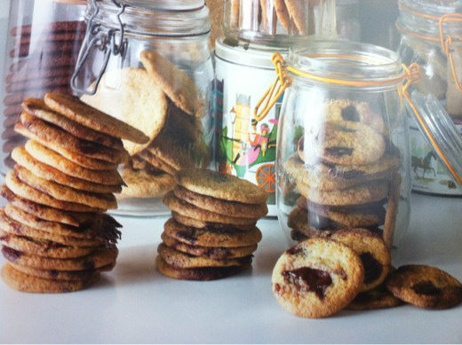

## Chocolate Cookie

Although they use cocoa instead of chocolate, these biscuits are crisp, crumbly and have a lovely concentrated chocolate flavour. To make them even more indulgent, add the golden syrup chocolate chips on p.360 towards the end of mixing for a double choc chip biscuit.

The dough can be frozen in individual portions and baked for surprise guests.

### Ingredients

Makes approx. 20 biscuits

|      |      |                             |
| ---: | :--- | --------------------------- |
|  135 | g    | Plain flour                 |
|   10 | g    | Cocoa powder                |
|  1/2 | tsp  | Bicarbonate of soda         |
|  1/2 | tsp  | Salt                        |
|  115 | g    | Cold unsalted butter, cubed |
|  130 | g    | Unrefined caster sugar      |

### Method

1. Pre-heat the oven to 190C.
2. Sift the flour, cocoa powder, bicarbonate of soda and salt together into a bowl, and set to one side.
3. Using a mixer fitted with the paddle attachment, cream the butter and sugar on medium speed until the mixture becomes light and fluffy (approximately 5 minutes).
4. Reduce the speed of the mixer to low, then add the flour mixture to the mixing bowl. Continue to mix until the dough comes together.
5. Using an ice-cream scoop, portion the dough into balls (approximately 40g per ball). Place them on a parchment lined baking tray roughly 10cm apart.
6. Place the tray in the oven for 10 minutes.
7. Allow to cool on the tray for 2 minutes before placing the biscuits on a cooling rack to cool completely.
8. The biscuits will keep for up to 5 days in an airtight tin.

[Heston at Home](https://www.librarything.com/work/11790862/book/88951785)