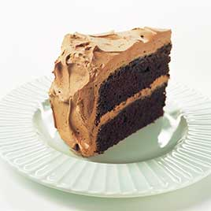

## Chocolate Layer Cake

The mixing method was the key to getting the right texture for our chocolate layer cake recipe. After trying both creaming and "reverse creaming," we turned to ribboning: whipping eggs with sugar until they double in volume, then adding the butter, dry ingredients, and milk. The egg foam aerated the cake, giving it both the structure and the tenderness that neither creaming nor reverse creaming could provide. To give our open-crumbed cake rich chocolate flavor, we simply melted unsweetened chocolate and cocoa powder in hot water over a double boiler, then stirred in sugar until it dissolved before adding the chocolate mixture to the batter.

### Ingredients

|           |                 |
| --------: | --------------- |
|      170g | butter          |
|      220g | plain flour     |
|      115g | chocolate       |
|       30g | cocoa           |
|   1/2 cup | hot water       |
|      350g | sugar           |
| 1 1/2 tsp | baking soda     |
|     1 tsp | salt            |
|     1 cup | buttermilk      |
|     2 tsp | vanilla extract |
|         4 | large eggs      |
|         2 | large egg yolks |

### Method

1. Adjust oven rack to middle position; heat oven to 175 degrees. Grease two 9-inch-round by 2-inch-high cake pans with softened butter; dust pans with flour and knock out excess. 
2. Combine chocolate, cocoa powder, and hot water in medium heatproof bowl; set bowl over saucepan containing 1 inch of simmering water and stir with rubber spatula until chocolate is melted, about 2 minutes. 
3. Add 1/2 cup sugar to chocolate mixture and stir until thick and glossy, 1 to 2 minutes. Remove bowl from heat and set aside to cool.
4. Whisk flour, baking soda, and salt in medium bowl. 
5. Combine buttermilk and vanilla in small bowl. 
6. In bowl of standing mixer fitted with whisk attachment, whisk eggs and yolks on medium-low speed until combined, about 10 seconds. 
7. Add remaining 1 1/4 cups sugar, increase speed to high, and whisk until fluffy and lightened in color, 2 to 3 minutes. 
8. Replace whisk with paddle attachment. Add cooled chocolate mixture to egg/sugar mixture and mix on medium speed until thoroughly incorporated, 30 to 45 seconds, pausing to scrape down sides of bowl with rubber spatula as needed. 
9. Add softened butter one tablespoon at a time, mixing about 10 seconds after each addition. 
10. Add about one-third of flour mixture followed by half of buttermilk mixture, mixing until incorporated after each addition (about 15 seconds). Repeat using half of remaining flour mixture and all of remaining buttermilk mixture (batter may appear separated). Scrape down sides of bowl and add remaining flour mixture; mix at medium-low speed until batter is thoroughly combined, about 15 seconds. 
11. Remove bowl from mixer and fold batter once or twice with rubber spatula to incorporate any remaining flour. Divide batter evenly between prepared cake pans; smooth batter to edges of pan with spatula.
12. Bake cakes until toothpick inserted into center comes out with a few crumbs attached, 25 to 30 minutes. 
13. Cool cakes in pans 15 minutes, then invert onto wire rack. Cool cakes to room temperature before frosting, 45 to 60 minutes.

[Cooks Illustrated](http://www.cooksillustrated.com/recipes/2905-old-fashioned-chocolate-layer-cake)