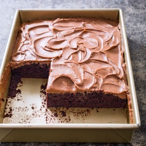

## Chocolate Sheet Cake

\ 

### Ingredients

|  Cake |                              |
| ----: | ---------------------------- |
|  223g | Granulated Sugar             |
|  130g | All Purpose Flour            |
| ½ tsp | baking soda                  |
| ½ tsp | salt                         |
| ¾ cup | milk                         |
|  170g | bittersweet chocolate        |
|   48g | Dutch processed cocoa powder |
| 180ml | vegetable oil                |
|     3 | eggs                         |
| 1 tsp | vanilla extract              |

### Method

1. Adjust oven rack to middle position and heat oven to 160**°C**
2. Lightly spray 24?-inch round baking pan with vegetable oil spray. 
3. Whisk sugar, flour, baking soda, and salt together in medium bowl; set aside.
4. Combine milk, chocolate, and cocoa in large saucepan. Place saucepan over low heat and cook, whisking frequently, until chocolate is melted and mixture is smooth. 
5. Remove from heat and let cool slightly, about 5 minutes. 
6. Whisk oil, eggs, and vanilla into chocolate mixture (mixture may initially look curdled) until smooth and homogeneous. 
7. Add sugar mixture and whisk until combined, making sure to scrape corners of saucepan.
8. Transfer batter to prepared pan; bake until firm in center when lightly pressed and toothpick inserted in center comes out with few crumbs attached, 30 to 35 minutes, rotating pan halfway through baking. 
9. Let cake cool completely in pan on wire rack before frosting, 1 to 2 hours.