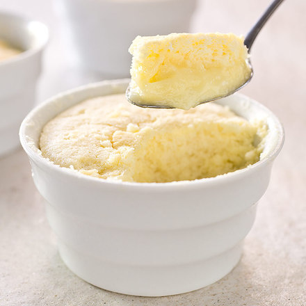

## Lemon Pudding Cakes

To take the temperature of the pudding layer, touch the probe tip to the bottom of the ramekin and pull it up 1/4 inch. The batter can also be baked in an 8-inch square glass baking dish. We like this dessert served at room temperature, but it can also be served chilled (the texture will be firmer). Spoon Blueberry Compote (see related content) over the top of each ramekin or simply dust with confectioners’ sugar.

### Ingredients

|      |       |      |                                      |
| ---: | ----- | ---- | ------------------------------------ |
|    1 | cup   |      | whole milk                           |
|    ½ | cup   |      | heavy cream                          |
|    3 | tbsp  |      | grated lemon zest                    |
|    ½ | cup   |      | juice (3 lemons)                     |
|  200 | g     |      | sugar                                |
|   35 | g     |      | All-Purpose Flour                    |
|    ½ | tsp   |      | Baking Powder                        |
|    ⅛ | tsp   |      | salt                                 |
|    2 | large |      | eggs, separated, plus 2 large whites |
|    ½ | tsp   |      | Vanilla Extract                      |

### Method

1. Adjust oven rack to middle position and heat oven to 160 degrees. 
2. Bring milk and cream to simmer in medium saucepan over medium-high heat. 
3. Remove pan from heat, whisk in lemon zest, cover pan, and let stand for 15 minutes. 
4. Meanwhile, fold dish towel in half and place in bottom of large roasting pan. Place six 6-ounce ramekins on top of towel and set aside pan.
5. Strain milk mixture through fine-mesh strainer into bowl, pressing on lemon zest to extract liquid; discard lemon zest. 
6. Whisk 3/4 cup sugar, flour, baking powder, and salt in second bowl until combined. Add egg yolks, vanilla, lemon juice, and milk mixture and whisk until combined. (Batter will have consistency of milk.)
7. Using stand mixer fitted with whisk, whip egg whites on medium-low speed until foamy, about 1 minute. 
8. Increase speed to medium-high and whip whites to soft, billowy mounds, about 1 minute. 
9. Gradually add remaining 1/4 cup sugar and whip until glossy, soft peaks form, 1 to 2 minutes.
10. Whisk one-quarter of whites into batter to lighten.
11. With rubber spatula, gently fold in remaining whites until no clumps or streaks remain. 
12. Ladle batter into ramekins (ramekins should be nearly full). 
13. Pour enough cold water into pan to come one-third of way up sides of ramekins. 
14. Bake until cake is set and pale golden brown and pudding layer registers 172 to 175 degrees at center, 50 to 55 minutes.
15. Remove pan from oven and let ramekins stand in water bath for 10 minutes. 
16. Transfer ramekins to wire rack and let cool completely. Serve.

[cooksillustrated.com](https://www.cooksillustrated.com/recipes/7781-lemon-pudding-cakes)